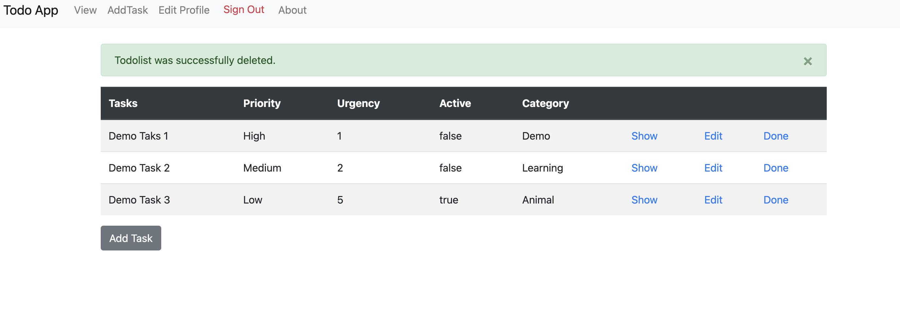

### Todo App webapp 
#### A common place for all your important tasks that need to be done. 

#### overview 
Rails is a web-application framework that includes everything needed to create database-backed web applications according to the Model-View-Control pattern. This Project has used MVC and CRUD concepts of the ruby on rails techstack.


#### Prerequisites

Before you onboard the rails flight make sure you have following tools installed in your system.

- Ruby 3.x
- Rails 7.x

#### 1. Check out the repository

```bash
git clone git@github.com:arbinydv/Todo-app.git
```
#### 2. Setting up local development environment
* Make sure you have properly installed the required version of the ruby and rails to avoid `devise` package dependencies issues. 
 
* [RoR Installation Guidlines](https://guides.rubyonrails.org/getting_started.html)

* Add [Devise](https://github.com/heartcombo/devise) for authentication feature.
 ```ruby
bundle add devise  # Adds devise to Gemfile
``` 
 - Install Devise 
```ruby
bundle install   # Install Devise 
```  
 - Generate Devise config 
```ruby
rails g devise:install # Generate Devise config
```   
You can start the rails server using the command given below.

```ruby
bundle exec rails s
```

And now you can visit the site with the URL http://localhost:3000

Read more on [Devise Auth Setup in Rails 7](https://betterprogramming.pub/devise-auth-setup-in-rails-7-44240aaed4be)
